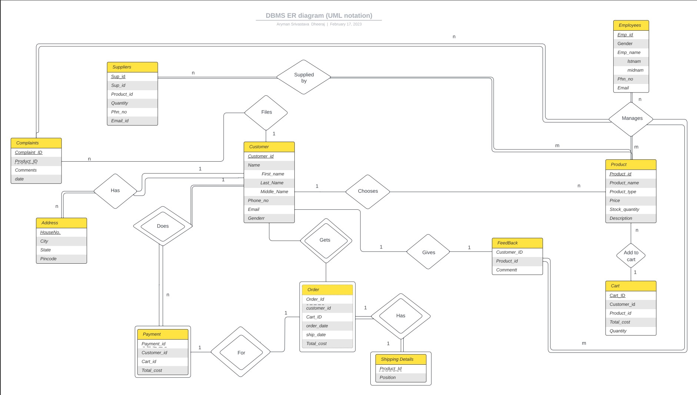

# Online-Retail-Store 

 <b>Tech Stack:</b> Python, MySQl 
 
Designed a Database Management System for an e-commerce clone of the Amazon website. Python for the development of the backend. Implemented features user authentication, cart management, order management etc.<be>

 <b>UML Diagram</b> 

